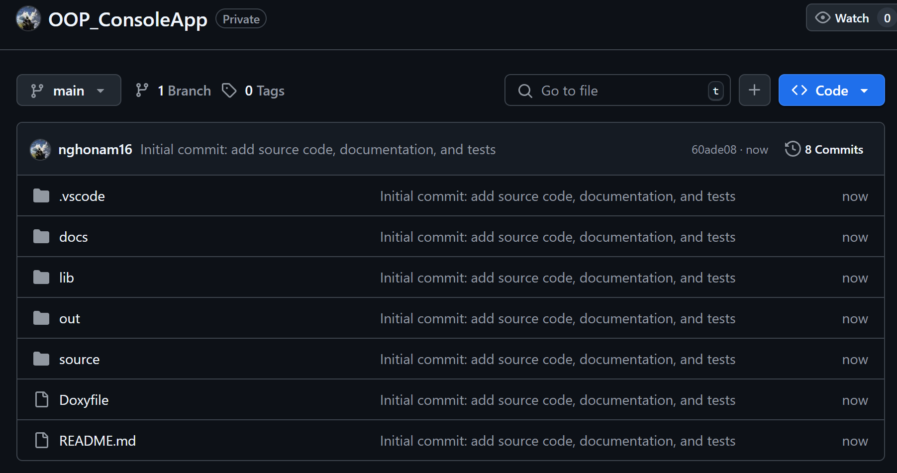

# Lab_Week02 – OOP Project

## 💡 Cải tiến so với mã nguồn ban đầu

### 1. Tổ chức lại cấu trúc dự án:
- Di chuyển các file `.h` và `.cpp` vào thư mục `lib/`, giúp mã nguồn gọn gàng, dễ quản lý hơn.
- Đặt file `main.cpp` và `main_tests.cpp` trong thư mục `source/`, thể hiện rõ vai trò là mã nguồn chính và mã kiểm thử.
- Tạo thư mục `out/` chứa file thực thi `program` và `tests`, dễ dàng phân biệt giữa mã nguồn và kết quả biên dịch.

### 2. Tách mã thành các module rõ ràng:
- Tách code thành các file như `Utils.cpp/h`, `InputHandler.cpp/h`, `App.cpp/h`, giúp tăng khả năng tái sử dụng và bảo trì.

### 3. Thêm tài liệu tự động bằng Doxygen:
- Chỉ cần ghi chú trong các file `.h` là đủ.
- Sử dụng Doxygen để sinh ra file `docs/index.html`, giúp người đọc hiểu rõ cấu trúc và chức năng của từng module trong mã nguồn.

### 4. Viết test case cơ bản:
- Tạo file `main_tests.cpp` để kiểm thử các hàm chính trong chương trình.
- Biên dịch riêng file tests thành file thực thi `out/tests`, dễ dàng kiểm tra độc lập.

## 📷 Đã push thành công mã nguồn lên GitHub



---

## 📁 Cấu trúc thư mục
```
Lab_Week02
│
├── lib/ # Các module nguồn (header + source)
├── source/ # File main.cpp và main_tests.cpp
├── out/ # File thực thi chương trình và test
├── docs/ # Tài liệu tạo bởi Doxygen
├── Doxyfile # Cấu hình Doxygen
├── README.md # File hướng dẫn này
```
---

## ⚙️ Hướng dẫn biên dịch và chạy

### Biên dịch chương trình chính:

```
g++ -std=c++23 source/main.cpp lib/*.cpp -Ilib -o out/program
```
Chạy chương trình:

Trên Linux/macOS: 
```
./out/program
```

Trên Windows: 
```
.\out\program.exe
```

Biên dịch và chạy test:
```
g++ -std=c++23 source/main_tests.cpp lib/*.cpp -Ilib -o out/tests
./out/tests     # Linux/macOS
.\out\tests.exe # Windows
```
## 📚 Tạo tài liệu với Doxygen
### Tạo file cấu hình (nếu chưa có):

doxygen -g Doxyfile
Sửa file Doxyfile:

Chỉnh các thông số chính:
```
PROJECT_NAME = "Lab_Week02 – OOP Project"
OUTPUT_DIRECTORY = docs
INPUT = lib source
RECURSIVE = YES
GENERATE_HTML = YES
GENERATE_LATEX = NO
QUIET = YES
```
Tạo tài liệu: doxygen Doxyfile
Mở docs/index.html để xem tài liệu.

## 📝 Lưu ý
Comment chi tiết trong file header .h để Doxygen có thể tự động tạo tài liệu rõ ràng.

Giữ mã nguồn sạch, không dùng using namespace std; trong các file thư viện.

Kiểm tra kỹ lỗi biên dịch và runtime.

Sử dụng std::expected (C++23) để xử lý lỗi hợp lý.

## 📞 Liên hệ
Nếu cần trợ giúp, bạn có thể liên hệ tại:

Email: nghoofnam@gmail.com

GitHub: https://github.com/nghonam16

Cảm ơn bạn đã sử dụng dự án này!
